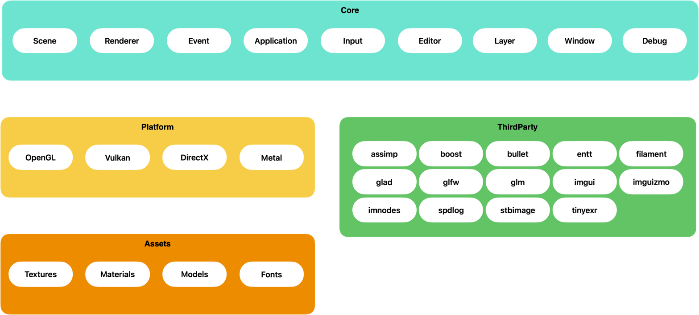
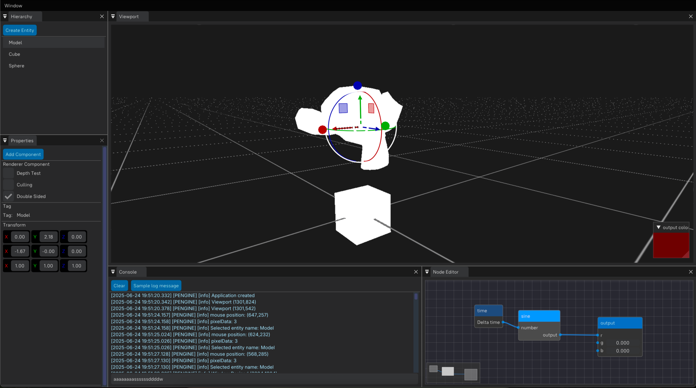

# Pro-Engine

## ⚙️ Compilation Flags

You can enable or disable debugging tools and engine features via `#define` directives or compiler flags.

### 🔧 Available Flags

| Flag                         | Description                                                                                                        |
|------------------------------|--------------------------------------------------------------------------------------------------------------------|
| `PROENGINE_SHADER_DEBUG`     | Displays shader compilation errors and warnings.                                                                   |
| `PROENGINE_DEBUG_LAYERS`     | The debug all the layers in the engine. This flag will print in the console all the layer names that are allocated |
| `PROENGINE_RENDER_DEBUG`     | Enables visual and logical debug output for the rendering system.                                                  |
| `PROENGINE_CULLING_DEBUG`    | Enables debug visualization for the object culling system.                                                         |
| `PROENGINE_DEBUG_FRUSTUM`    | Displays frustum information and visualizations for camera debugging.                                              |
| `PROENGINE_DEBUG_INPUT_KEYS` | Logs and displays input events such as key presses.                                                                |
| `PROENGINE_ENABLE_EDITOR`    | Enables the runtime editor for live inspection and editing.                                                        |

### Architecture Scheme

### Engine Preview

## 📚 Wiki
You can refer the documentation in the wiki page
https://github.com/Raphalsk050/ProEngine/wiki
